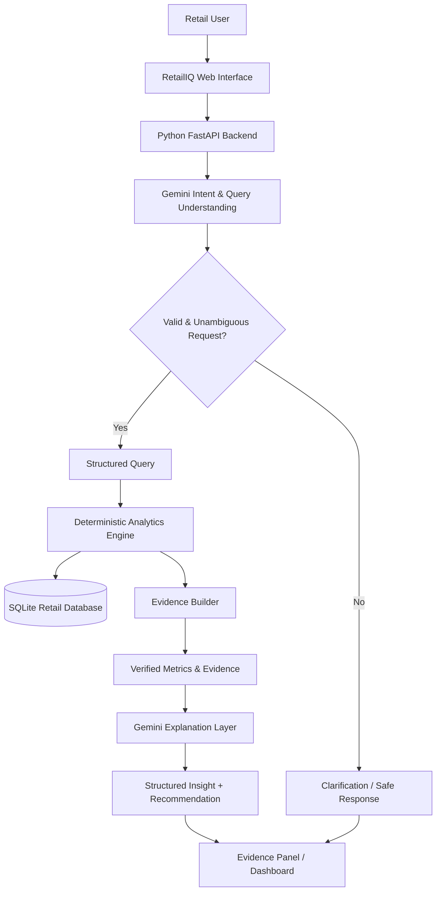

TRACK_ID=PS03

# RetailIQ

## Evidence-First Sales & Inventory Copilot

A GenAI-powered retail intelligence platform that transforms sales and inventory data into evidence-backed insights, risk alerts, and actionable recommendations.

RetailIQ combines deterministic retail analytics with Gemini-powered natural language understanding to help retailers answer questions, identify inventory risks, understand sales performance, and make data-driven decisions.

---

# Problem

Retail teams often have access to large amounts of sales and inventory data, but turning that data into timely decisions remains difficult.

Common challenges include:

* Identifying products that may run out soon
* Detecting overstocked inventory
* Understanding sales trends and changes
* Comparing product and store performance
* Finding unusual sales spikes or drops
* Translating business questions into useful data analysis
* Making inventory decisions using reliable evidence rather than intuition

Traditional dashboards often show numbers but require users to manually interpret them.

RetailIQ addresses this gap with an evidence-first AI copilot.

---

# Proposed Solution

RetailIQ provides a natural-language interface over structured retail data.

A user can ask questions such as:

> Which products are likely to run out soon?

> Which store performs best for keyboards?

> How did the wireless mouse perform this month?

> What products are overstocked?

> What should I pay attention to today?

RetailIQ converts these questions into structured analytical requests, performs the required calculations using deterministic Python analytics, and then uses Gemini to explain the results in natural language.

The system does not allow the LLM to invent business metrics.

Every important recommendation is accompanied by supporting evidence from the underlying retail data.

---

# Key Capabilities

### Sales Intelligence

* Revenue analysis
* Unit sales analysis
* Product performance
* Store performance
* Daily and monthly trends
* Period-over-period comparisons
* Sales growth and decline detection

### Inventory Intelligence

* Stock-out risk detection
* Inventory coverage estimation
* Reorder recommendations
* Overstock detection
* Fast-moving and slow-moving product identification

### Anomaly Detection

* Sales spikes
* Sales drops
* Unusual product behavior
* Store-level performance changes

### AI Copilot

Natural-language questions are converted into structured analytical requests and answered using verified retail data.

### Evidence-First Recommendations

Recommendations include supporting values such as:

* Current stock
* Average daily sales
* Days of inventory coverage
* Historical sales
* Reorder thresholds
* Relevant analysis period
* Calculation logic

### Safe Decision Support

RetailIQ handles uncertainty explicitly.

If the data is insufficient, incomplete, or ambiguous, the system should say so instead of generating an unsupported answer.

---

# System Architecture



## Architecture Principle

The architecture deliberately separates **reasoning** from **business-critical computation**.

### Gemini is responsible for:

* Natural-language understanding
* Intent classification
* Entity extraction
* Query interpretation
* Ambiguity detection
* Generating human-readable explanations

### Python is responsible for:

* Database queries
* Aggregations
* Revenue calculations
* Sales metrics
* Growth calculations
* Inventory coverage
* Stock-out risk
* Reorder calculations
* Overstock detection
* Trend and anomaly calculations

This separation reduces hallucination risk and keeps numerical decisions deterministic and auditable.

---

# Evidence-First Intelligence

RetailIQ follows an evidence-first principle:

```text
User Question
      ↓
Understand Intent
      ↓
Retrieve Relevant Data
      ↓
Perform Deterministic Calculations
      ↓
Build Evidence
      ↓
Generate Explanation
      ↓
Return Insight + Evidence
```

For example, instead of Gemini guessing whether a product is at risk:

```text
Current Stock = 18 units
Average Daily Sales = 5 units/day

Inventory Coverage
= Current Stock / Average Daily Sales
= 18 / 5
= 3.6 days
```

RetailIQ can then identify the product as a potential stock-out risk according to the configured threshold.

The numerical calculation is performed by Python, while Gemini explains the result to the user.

---

# Decision Intelligence

RetailIQ focuses on actionable retail decisions rather than simply displaying raw data.

### Stock-Out Risk

Estimated using:

```text
Days of Coverage =
Current Stock / Average Daily Sales
```

Products with insufficient coverage can be surfaced as high-priority inventory risks.

### Reorder Recommendation

Reorder quantities are calculated using deterministic inventory logic based on demand, current stock, reorder thresholds, and configured assumptions.

### Overstock Detection

Products with inventory significantly exceeding expected demand or coverage thresholds can be flagged for review.

### Sales Trends

Recent sales performance can be compared against historical baselines to identify meaningful increases or decreases.

### Store Comparison

Product and category performance can be evaluated across stores to identify high-performing locations.

---

# Handling Ambiguity and Insufficient Data

RetailIQ is designed to avoid unsupported answers.

### Ambiguous Requests

If a user asks:

> How are the headphones doing?

and multiple headphone products exist, RetailIQ should identify the ambiguity and request clarification instead of arbitrarily selecting a product.

### Insufficient Data

If the requested analysis requires a period or metric that is not sufficiently represented in the available data, RetailIQ should clearly communicate the limitation.

Example:

> The available dataset does not contain enough data to provide a complete August comparison.

This makes the copilot safer and more trustworthy for business decision support.

---

# Technology Stack

| Layer            | Technology                                   |
| ---------------- | -------------------------------------------- |
| Backend          | Python 3.11                                  |
| API              | FastAPI                                      |
| Database         | SQLite                                       |
| Data Processing  | Pandas                                       |
| Generative AI    | Google Gemini API                            |
| Embeddings       | Gemini `gemini-embedding-001` where required |
| Frontend         | React                                        |
| Styling          | Tailwind CSS                                 |
| Charts           | Recharts                                     |
| Local Data       | CSV / SQLite                                 |
| Deployment Model | Single Python application                    |

The application is designed to operate without hosted databases, hosted vector stores, or additional AI providers.

---

# Project Structure

```text
RetailIQ/
├── app.py
├── requirements.txt
├── README.md
├── .gitignore
│
├── src/
│   ├── __init__.py
│   ├── config.py
│   ├── database.py
│   ├── models.py
│   ├── analytics.py
│   ├── intent.py
│   ├── gemini_client.py
│   ├── evidence.py
│   ├── copilot.py
│   └── api.py
│
├── data/
│   ├── products.csv
│   ├── stores.csv
│   ├── sales.csv
│   └── inventory.csv
│
├── frontend/
│   └── dist/
│
└── tests/
```

---

# Data

RetailIQ uses a locally generated synthetic retail dataset designed to represent realistic business scenarios.

The dataset contains:

* Product information
* Store information
* Historical sales
* Current inventory
* Pricing information
* Reorder thresholds

The synthetic data includes realistic variations such as:

* Fast-moving products
* Slow-moving products
* Stock-out risks
* Overstock
* Sales spikes
* Sales declines
* Store-specific demand differences

No external dataset is required.

---

# Data Integrity

RetailIQ maintains consistency between sales and inventory data.

For example:

```text
Revenue = Quantity × Unit Price
```

The system validates:

* Product references
* Store references
* Inventory references
* Sales quantities
* Prices
* Revenue calculations
* Required dataset fields

---

# User Experience

The RetailIQ interface is designed around a business intelligence workflow.

### Dashboard

Provides a high-level view of:

* Revenue
* Units sold
* Inventory health
* Products at risk
* Overstock
* Sales trends
* Store performance

### Attention Center

Highlights the most important issues requiring review.

Examples:

* Critical stock-out risk
* Severe overstock
* Significant sales decline
* Unusual sales spike

### AI Copilot

Allows users to interact with retail data using natural language.

### Evidence Panel

Shows the underlying metrics and calculations supporting an AI-generated recommendation.

---

# Example Queries

RetailIQ is designed to answer questions such as:

```text
Which products are likely to run out soon?

What products are overstocked?

Which store sells keyboards best?

How did the wireless mouse perform this month?

Compare this month's sales with last month.

What should I pay attention to today?

Why should I reorder this product?
```

---

# Reliability & Safety

RetailIQ follows several principles for trustworthy AI-assisted analytics:

* Business-critical calculations are deterministic.
* LLM output is grounded in retrieved application data.
* Recommendations expose supporting evidence.
* Ambiguous requests are clarified.
* Insufficient data is explicitly reported.
* AI failures should not break core deterministic analytics.
* API keys are loaded through environment variables.
* Secrets are never committed to source control.

---

# Configuration

Set the Gemini API key through an environment variable:

```bash
GEMINI_API_KEY=your_api_key_here
```

Never commit the API key to the repository.

---

# Getting Started

## Requirements

* Python 3.11
* Gemini API key

## Installation

From the repository root:

```bash
pip install -r requirements.txt
```

## Run

```bash
python app.py
```

The application is available at:

```text
http://localhost:8000
```

The application is designed to start using a single command sequence from the repository root.

---

# Demo

Demo Video:

`[Add Devfolio / YouTube demo link here]`

The demonstration should showcase:

1. Retail dashboard
2. Natural-language query
3. Stock-out risk analysis
4. Evidence behind a recommendation
5. Sales intelligence
6. Ambiguous query handling
7. Insufficient-data handling

---

# Hackathon Track

```text
PS03 — Retail: Sales and Inventory Copilot
```

RetailIQ demonstrates how GenAI can be combined with deterministic analytics to create a trustworthy decision-support system for retail sales and inventory management.

---

# Vision

RetailIQ aims to move retail analytics from:

```text
Raw Data → Manual Analysis → Decision
```

to:

```text
Natural Language → Verified Analytics → Evidence → Action
```

The goal is not simply to add AI to a dashboard, but to create a reliable retail decision copilot where every important recommendation can be traced back to data.
