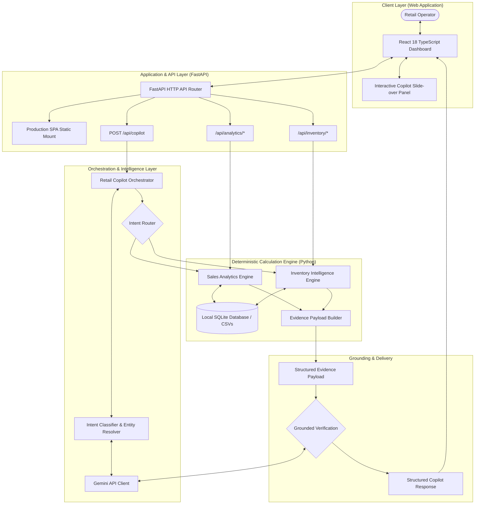

TRACK_ID=PS03

# RetailIQ — Evidence-First Sales & Inventory Copilot

<div align="center">

[](https://github.com/MAHA-VIDHYA-SRI-L/RetailIQ)
[](https://retailiq-eight.vercel.app/)
[](https://www.python.org/)
[](https://fastapi.tiangolo.com/)
[](https://reactjs.org/)
[](https://docs.pytest.org/)
[](LICENSE)

**An evidence-grounded AI copilot bridging natural-language interaction with deterministic retail intelligence.**

*Built for retail operators, inventory planners, and regional managers.*

[**Explore Live Demo**](https://retailiq-eight.vercel.app/) • [**Interactive API Docs**](https://retailiq-eight.vercel.app/docs) • [**GitHub Repository**](https://github.com/MAHA-VIDHYA-SRI-L/RetailIQ)

</div>

---

> [!IMPORTANT]
> **Core Architectural Principle**
> 
> **Gemini understands and explains. Python calculates. Evidence proves.**
> 
> Business-critical metrics (revenue, unit velocity, days of inventory coverage, stockout risk levels, and replenishment quantities) are **never calculated by the LLM**. Every narrative response is synthesized strictly from deterministic analytical evidence tables produced by Python and SQLite.

---

## Executive Summary

Retail operations generate massive amounts of daily transaction receipts and inventory snapshots across distributed physical store locations. However, translating raw data into timely replenishment and merchandising actions remains manual, error-prone, and slow.

**RetailIQ** solves this challenge by pairing Google Gemini natural-language understanding with a deterministic Python calculation engine. Store managers can ask unstructured questions in plain English—from stock-out alerts to regional revenue comparisons—and receive grounded, auditable answers backed by verifiable mathematical evidence.

---

## Table of Contents

1. [Problem Statement](#1-problem-statement)
2. [The RetailIQ Solution](#2-the-retailiq-solution)
3. [The Evidence-First Paradigm](#3-the-evidence-first-paradigm)
4. [System Architecture](#4-system-architecture)
5. [The AI-Deterministic Boundary](#5-the-ai-deterministic-boundary)
6. [Core Functional Modules](#6-core-functional-modules)
   - [Sales Intelligence](#sales-intelligence)
   - [Inventory Intelligence](#inventory-intelligence)
   - [Unified Attention Feed](#unified-attention-feed)
   - [Interactive AI Copilot](#interactive-ai-copilot)
7. [Inventory Mathematics & Risk Matrix](#7-inventory-mathematics--risk-matrix)
8. [Ambiguity & Boundary Handling](#8-ambiguity--boundary-handling)
9. [Dataset Specification](#9-dataset-specification)
10. [REST API Reference](#10-rest-api-reference)
11. [Validated Demo Scenarios](#11-validated-demo-scenarios)
12. [Security, Safety & Reliability](#12-security-safety--reliability)
13. [Installation & Getting Started](#13-installation--getting-started)
14. [Evaluation & Test Suite](#14-evaluation--test-suite)
15. [Deployment Architecture](#15-deployment-architecture)
16. [Future Roadmap](#16-future-roadmap)
17. [Project & Hackathon Metadata](#17-project--hackathon-metadata)

---

## 1. Problem Statement

Modern multi-store retail management suffers from three systemic operational challenges:

```text
┌─────────────────────────────────────────────────────────────────────────────┐
│                           The Retail Analytics Gap                          │
├─────────────────────────┬─────────────────────────┬─────────────────────────┤
│    Stock-Out Risks      │   Overstock Capital     │    Unreliable AI Tools  │
├─────────────────────────┼─────────────────────────┼─────────────────────────┤
│ Fast-moving bestsellers │ Slow-moving inventory   │ Generic LLMs invent or  │
│ run dry unnoticed       │ ties up working capital │ hallucinate metrics     │
│ before purchase orders  │ and incurs holding fees │ without database ground │
│ are dispatched.         │ without demand signals. │ truth or audit trails.  │
└─────────────────────────┴─────────────────────────┴─────────────────────────┘
```

* **Fragmented Transaction Records**: Point-of-sale data sits across store-specific silos, making regional velocity comparisons difficult.
* **Complex Multi-Variable Mathematics**: Accurately calculating daily sales velocity, safety stock, target stock, and reorder levels across dozens of SKUs requires complex manual spreadsheet work.
* **The "Black Box" LLM Trap**: Conventional conversational dashboards pass raw prompts directly to LLMs, which frequently fabricate numbers, assume fictitious dates, and make unverified inventory claims.

---

## 2. The RetailIQ Solution

RetailIQ provides an **auditable, evidence-first copilot platform** designed for day-to-day retail execution:

* **Conversational Simplicity**: Operators ask questions in natural language (*"Which products are likely to run out soon?"*, *"Which store generated the most revenue?"*).
* **Deterministic Execution**: Calculations are carried out by strict, deterministic Python engines directly against SQLite databases.
* **Grounded Synthesis**: Gemini translates verified numerical results into executive summaries without hallucinating calculations.
* **Dual Representation**: Every answer in the UI includes both a natural-language executive briefing and an expandable **Evidence Panel** displaying exact database records, applied assumptions, and formulas.

---

## 3. The Evidence-First Paradigm

RetailIQ enforces a fundamental architectural departure from conventional generative analytics tools:

```text
Traditional Conversational BI (High Hallucination Risk):
User Question ──────► LLM Attempts Numerical Calculation ──────► Unverified / Invented Output

RetailIQ Evidence-First Pipeline (Deterministic & Auditable):
User Question
      │
      ▼
Intent & Entity Resolution ──► Gemini NLU + Local Catalog Matching
      │
      ▼
Deterministic Engine       ──► Parameterized SQL Aggregation in Python (Zero LLM Math)
      │
      ▼
Evidence Construction      ──► Exact Proof Payload (Stock, ADS, Coverage, Reorder Qty)
      │
      ▼
Grounded AI Synthesis      ──► Gemini Formulates Briefing Strictly from Evidence Payload
      │
      ▼
Grounded Decision Briefing ──► Answer + Interactive Evidence Drawer + Quantified Recommendations
```

---

## 4. System Architecture

RetailIQ is organized into a clean, decoupled full-stack architecture:



---

## 5. The AI-Deterministic Boundary

RetailIQ enforces strict role separation between natural-language understanding and business computation:

| Operational Responsibility | Assigned Technology | Guarantees & Enforcement |
| :--- | :--- | :--- |
| **Natural Language Understanding** | Google Gemini API (`gemini-1.5-flash`) | Zero-shot intent classification into typed schema. |
| **Intent & Confidence Scoring** | Gemini + Python Fallback | Fallback to deterministic regex/keyword heuristics if offline. |
| **Entity Resolution & Validation** | Python + SQLite Catalog | Validates SKU IDs, product names, aliases, and store locations. |
| **Ambiguity Detection** | Python Algorithm | Detects multi-product matches (e.g. *"headphones"*) and requests clarification. |
| **Revenue Calculation** | Python Deterministic Math | Exact line-item computation: $\text{Revenue} = \text{Quantity} \times \text{Unit Price}$. |
| **Sales Aggregation** | Python + SQLite | Parameterized SQL sums, daily velocity, and period comparisons. |
| **Average Daily Sales (ADS)** | Python | Rolling 30-day demand velocity calculation. |
| **Inventory Coverage** | Python | Safe zero-division computation: $\text{Current Stock} / \text{ADS}$. |
| **Stockout Risk Classification** | Python | Categorization into `CRITICAL`, `HIGH`, `MEDIUM`, and `LOW`. |
| **Target Stock & Reorder Sizing** | Python | Quantitative formula: $\max(0, \text{Target Stock} - \text{Current Stock})$. |
| **Evidence Formulation** | Python | Packages computed numerical proofs into auditable evidence tables. |
| **Executive Synthesis & Narrative** | Google Gemini API | Explains verified results in natural English based exclusively on evidence. |

> [!NOTE]
> Under no circumstance is Gemini permitted to compute arithmetic, aggregate financial sums, or extrapolate ungrounded stock levels.

---

## 6. Core Functional Modules

### Sales Intelligence
* **Portfolio Sales Overview**: Live monitoring of gross revenue, total units sold, transaction count, and average order value.
* **Daily Sales Trend**: Chronological 120-day time-series tracking with peak volume highlighting and baseline anomaly tracking.
* **Top Performing Products**: SKU revenue and unit rankings filtered across 6 major retail categories.
* **Regional Store Comparison**: Store-by-store volume and revenue contribution benchmarking across physical metropolitan locations.
* **Period-over-Period Comparison**: Growth/decline tracking between customized or predefined date ranges.

### Inventory Intelligence
* **Stock-Out Risk Engine**: Real-time identification of inventory below critical demand thresholds.
* **Coverage Days Tracking**: Continuous evaluation of on-hand inventory duration based on rolling daily velocity.
* **Overstock Detection**: Automatic flagging of items with $> 30.0$ days of coverage and computation of idle capital.
* **Velocity Classification**: ABC segmentation into Fast-moving ($\ge 12.0$ units/day network), Medium-moving ($4.0 - 12.0$ units/day), and Slow-moving ($< 4.0$ units/day) tiers.
* **Deterministic Reorder Sizing**: Replenishment recommendations calculated to maintain 21-day target buffer stock.

### Unified Attention Feed
The **Priority Attention Feed** combines multi-dimensional operational signals into a single prioritized queue:
1. **Critical Stockouts**: Coverage $\le 3.0$ days with active customer demand.
2. **High Stockouts**: Coverage $3.0 - 7.0$ days requiring supplier replenishment this week.
3. **Severe Overstocks**: Substantial excess stock ($> 30.0$ days) tying up working capital.
4. **Demand Surges & Drops**: Unexpected velocity shifts compared to historical baselines.

### Interactive AI Copilot
* **Natural-Language Querying**: Interactive slide-over drawer accessible from any dashboard page.
* **Proactive Quick Questions**: One-click quick prompts for stockout checks, store performance, reorder planning, and trend analysis.
* **Interactive Evidence Inspector**: Expandable data tables embedded inside each conversational reply.
* **Assumptions & Recommendations**: Transparent operational guidance detailing the mathematical rules applied.

---

## 7. Inventory Mathematics & Risk Matrix

RetailIQ implements standardized, auditable retail inventory logic:

```text
1. Average Daily Sales (ADS):
   ADS = (Total Units Sold over 30 Days) / 30

2. Days of Inventory Coverage:
   Coverage Days = Current Stock / ADS

3. Target Stock Buffer:
   Target Stock = round(ADS × 21 Target Days)

4. Recommended Reorder Quantity:
   Reorder Qty = max(0, Target Stock - Current Stock)
```

$$\text{Average Daily Sales (ADS)} = \frac{\sum_{i=1}^{N} \text{Units Sold}_i}{\text{Demand Window Days (30)}}$$

$$\text{Days of Coverage} = \frac{\text{Current Stock}}{\text{Average Daily Sales}}$$

$$\text{Target Stock} = \text{round}\left(\text{Average Daily Sales} \times \text{Target Coverage Days (21)}\right)$$

$$\text{Recommended Reorder Quantity} = \max\left(0, \text{Target Stock} - \text{Current Stock}\right)$$

### Risk Classification Matrix

| Risk Level | Coverage Days Threshold | Operational Meaning | System Action |
| :--- | :---: | :--- | :--- |
| **CRITICAL** | $\le 3.0$ days | Imminent stockout within 72 hours | Red alert; immediate priority purchase order |
| **HIGH** | $3.0 - 7.0$ days | Stockout likely within the current week | Amber alert; include in standard replenishment cycle |
| **MEDIUM** | $7.0 - 14.0$ days | Buffer stock within acceptable operating band | Monitor during routine review |
| **LOW / HEALTHY** | $> 14.0$ days | Fully stocked with adequate safety cushion | Normal operation; no action required |
| **OVERSTOCK** | $> 30.0$ days | Excess inventory tying up operating capital | Pause procurement; consider promotional clearance |

---

## 8. Ambiguity & Boundary Handling

RetailIQ avoids arbitrary guessing or silent assumptions when handling edge cases:

### 1. Ambiguous Product Queries
* **Scenario**: Operator asks *"How are the headphones doing?"*.
* **Behavior**: The catalog contains both *Noise-Cancelling Wireless Earbuds* and *Bluetooth Soundbar 40W*.
* **System Action**: Sets `needs_clarification=True`, assigns `data_status="ambiguous"`, and returns a clarification prompt listing candidate products rather than arbitrarily guessing.

### 2. Unknown Products or Stores
* **Scenario**: Operator queries *"How is the XYZ Ultra Phone performing?"* or *"Store 999"*.
* **Behavior**: Entity matcher discovers no matching record in the SQLite database.
* **System Action**: Returns `data_status="no_data"` stating the entity was not found, with zero hallucinated sales.

### 3. Out-of-Dataset Date Inquiries
* **Scenario**: Operator queries *"Show sales from January 2030."*.
* **Behavior**: The query period extends beyond dataset boundaries (`2026-05-08` to `2026-09-04`).
* **System Action**: Returns `data_status="no_data"` explaining that no sales records exist for the specified timeframe.

### 4. Resilient Offline Operation
* **Scenario**: The application starts without `GEMINI_API_KEY`, or Gemini API requests time out.
* **Behavior**: All analytics routes (`/api/analytics/*`, `/api/inventory/*`) continue operating at 100% capacity.
* **System Action**: The Copilot engages its rule-based keyword classifier and returns structured, deterministic template explanations grounded in evidence.

---

## 9. Dataset Specification

RetailIQ ships with a validated synthetic retail dataset designed to model real-world operational distributions:

* **Products (`data/products.csv`)**: 40 distinct SKUs across 6 categories:
  * *Electronics* (Mice, Keyboards, Webcams, Earbuds, Soundbars, Power Banks)
  * *Accessories* (Laptop Stands, Backpacks, USB Hubs, Cables)
  * *Home* (Desk Lamps, Mugs, Diffusers, Flasks, Bed Sheets)
  * *Personal Care* (Electric Toothbrushes, Trimmers, Sunscreens)
  * *Office* (Notebooks, Ergonomic Cushions, File Trays, Wrist Rests)
  * *Grocery* (Arabica Coffee, Masala Chai, Coconut Oil, Almonds, Rolled Oats)
* **Store Locations (`data/stores.csv`)**: 4 metropolitan retail hubs:
  * `STR001`: RetailIQ Prime — Indiranagar, Bengaluru
  * `STR002`: RetailIQ Hub — Bandra West, Mumbai
  * `STR003`: RetailIQ Metro — Connaught Place, Delhi
  * `STR004`: RetailIQ Express — HITEC City, Hyderabad
* **Transaction History (`data/sales.csv`)**: **11,119 verified transaction records** spanning 120 days (`2026-05-08` to `2026-09-04`).
  * Total Network Revenue: **₹34,099,044.00**
  * Total Units Sold: **39,226 units**
* **Inventory State (`data/inventory.csv`)**: **160 SKU-store combinations** with calibrated stock and reorder thresholds.
  * Verified Mathematical Integrity: $\text{Revenue} = \text{Quantity} \times \text{Unit Price}$ across 100% of rows (0 mismatches).

---

## 10. REST API Reference

### Analytics Endpoints (`/api/analytics`)
* `GET /api/analytics/summary` — Aggregate portfolio revenue, units, transactions, and daily revenue.
* `GET /api/analytics/trend` — Chronological daily sales time-series data.
* `GET /api/analytics/top-products` — Top performing products ranked by revenue or volume.
* `GET /api/analytics/categories` — Category breakdown with revenue contribution percentages.
* `GET /api/analytics/products/{product_id}` — Granular sales analytics for a specific SKU.
* `GET /api/analytics/stores/{store_id}` — Store-level performance metrics.
* `GET /api/analytics/compare-periods` — Compare sales metrics across customized date ranges.

### Inventory Endpoints (`/api/inventory`)
* `GET /api/inventory/health` — Inventory valuation, risk distributions, overstock metrics, and percentages.
* `GET /api/inventory/risks` — Prioritized list of products at stockout risk sorted by coverage urgency.
* `GET /api/inventory/overstock` — Overstocked records ($> 30.0$ days coverage) with calculated locked capital.
* `GET /api/inventory/attention` — Operational attention feed merging stockouts, overstock, and velocity anomalies.
* `GET /api/inventory/velocity` — Product segmentation into Fast, Medium, and Slow tiers.
* `GET /api/inventory/{product_id}` — Store-by-store inventory and replenishment requirements for a SKU.

### Catalog Endpoints (`/api/catalog`)
* `GET /api/catalog/products` — Retrieve active product catalog with category filtering.
* `GET /api/catalog/stores` — Retrieve list of retail store locations.

### Copilot & System Endpoints
* `POST /api/copilot` — End-to-end question answering pipeline returning grounded answers and evidence tables.
* `POST /api/copilot/intent` — Direct natural-language intent classification and entity resolution.
* `GET /health` — Service health check identifying application status, name, and hackathon track (`PS03`).
* `GET /docs` — Interactive OpenAPI / Swagger documentation UI.

---

## 11. Validated Demo Scenarios

The following representative questions have been verified against the live RetailIQ engine:

```text
1. Stock-Out Risk Detection:
   Q: "Which products are likely to run out soon?"
   ► Identified 18 product/store combinations at risk.
   ► Top Critical Risk: Braided Nylon USB-C Cable (2m) at Indiranagar (2.75 days coverage).

2. Store Performance Comparison:
   Q: "Which store generated the most revenue?"
   ► Evaluated all 4 regional locations.
   ► #1 Store: RetailIQ Prime - Indiranagar with ₹9,781,501.00 revenue.

3. Overstock Capital Analysis:
   Q: "Which products are overstocked?"
   ► Identified 36 overstocked records tying up ₹837,200.00 in excess capital.
   ► Top Item: Ultrasonic Aroma Diffuser & Humidifier (61.4 days coverage).

4. Sales Trend Monitoring:
   Q: "Show me the sales trend."
   ► Aggregated 120 chronological daily sales points totaling ₹34,099,044.00.

5. Inventory Replenishment:
   Q: "What should I reorder?"
   ► Reorder Sizing: Quantified replenishment for items at risk to achieve 21-day target buffer.

6. Category Contribution:
   Q: "How are Electronics performing?"
   ► Electronics: ₹16,155,170.00 revenue (9,630 units sold; 47.38% network share).
```

---

## 12. Security, Safety & Reliability

* **Zero Committed Secrets**: `GEMINI_API_KEY` is loaded strictly server-side from environment variables. Audited with `git grep "AIza"` (0 occurrences).
* **SQL Injection Immunity**: 100% of SQLite database interactions utilize parameterized placeholders (`?`). No arbitrary SQL execution endpoints exist.
* **Input Validation & Sanitization**: Enforced via Pydantic v2 schemas; empty, null, or malformed queries return clean HTTP 400/422 responses with zero traceback leakage.
* **React Error Boundary**: The frontend is wrapped in a top-level error boundary to ensure runtime rendering errors present recovery options rather than a blank screen.
* **Offline Test Isolation**: All 99 automated tests execute with mocked Gemini responses and local SQLite data, requiring zero external internet access.

---

## 13. Installation & Getting Started

### Prerequisites
* Python 3.11+
* Node.js 18+ *(Only required if editing frontend code; pre-compiled production bundle is already included in `frontend/dist/`)*
* Optional: Google Gemini API Key *(for live LLM narrative synthesis; deterministic analytics function 100% offline without it)*

### Quick Start (Local)

```bash
# 1. Clone repository
git clone https://github.com/MAHA-VIDHYA-SRI-L/RetailIQ.git
cd RetailIQ

# 2. Install Python dependencies
pip install -r requirements.txt

# 3. (Optional) Configure Gemini API Key
# Linux / macOS:
export GEMINI_API_KEY="your_api_key_here"
# Windows PowerShell:
$env:GEMINI_API_KEY="your_api_key_here"
# Windows Command Prompt:
set GEMINI_API_KEY="your_api_key_here"

# 4. Launch Application
python app.py
```

Access the application in your browser:
* **Dashboard UI**: [http://localhost:8000](http://localhost:8000)
* **Interactive API Docs**: [http://localhost:8000/docs](http://localhost:8000/docs)
* **Health Check**: [http://localhost:8000/health](http://localhost:8000/health)

---

## 14. Evaluation & Test Suite

RetailIQ includes an automated test suite verifying every component from database transactions to copilot orchestration:

```bash
# Run complete test suite
python -m pytest
```

### Verified Test Results

```text
============================= test session starts =============================
platform win32 -- Python 3.11.9, pytest-9.1.1, pluggy-1.6.0
rootdir: E:\Inventions\RetailIQ
plugins: anyio-4.12.1
collected 99 items

tests/test_analytics.py ................                                 [ 16%]
tests/test_copilot.py ........................                           [ 40%]
tests/test_data.py .................                                     [ 57%]
tests/test_database.py ........                                          [ 65%]
tests/test_frontend_serving.py ....                                      [ 69%]
tests/test_gemini.py ...........                                         [ 80%]
tests/test_health.py ..                                                  [ 82%]
tests/test_inventory.py .................                                [100%]

============================= 99 passed in 11.44s =============================
```

### Automated Live Demonstration Validator
A dedicated verification script is included to test live server endpoints:

```bash
python scripts/validate_hackathon_demo.py
```

---

## 15. Deployment Architecture

RetailIQ is production-configured for serverless cloud deployment on **Vercel**:

* **Live Deployment URL**: [https://retailiq-eight.vercel.app/](https://retailiq-eight.vercel.app/)
* **Zero Cold-Start Crash**: Automatically provisions the SQLite database into `/tmp/retailiq.db` in read-only serverless environments.
* **Unified Entrypoint (`api/index.py`)**: Seamlessly wraps the FastAPI ASGI application with `VercelPathMiddleware` to handle path normalization and client routing.
* **Pre-compiled SPA Bundle**: The React/TypeScript single-page application is compiled into `frontend/dist/` and served directly with asset caching.

---

## 16. Future Roadmap

* **Live POS Webhook Ingestion**: Real-time integration with modern point-of-sale systems for sub-second inventory decrementing.
* **Supplier Lead-Time Tracking**: Dynamic reorder threshold adjustment based on supplier shipping variances.
* **Automated Purchase Order Drafts**: Direct EDI/ERP connector integration to draft POs based on verified reorder quantities.
* **Machine Learning Demand Forecasting**: Seasonal ARIMA/Prophet models incorporated into deterministic Python baselines.
* **Role-Based Access Control (RBAC)**: Distinct permissions for store associates, store managers, and regional executives.

---

## 17. Project & Hackathon Metadata

* **Project Name**: RetailIQ — Evidence-First Sales & Inventory Copilot
* **Hackathon Track**: `PS03 — Retail: Sales and Inventory Copilot`
* **Live Deployment**: [https://retailiq-eight.vercel.app/](https://retailiq-eight.vercel.app/)
* **Interactive API Docs**: [https://retailiq-eight.vercel.app/docs](https://retailiq-eight.vercel.app/docs)
* **Repository**: [https://github.com/MAHA-VIDHYA-SRI-L/RetailIQ](https://github.com/MAHA-VIDHYA-SRI-L/RetailIQ)
* **Architecture Style**: Evidence-First Deterministic Copilot
* **License**: [MIT License](LICENSE)
