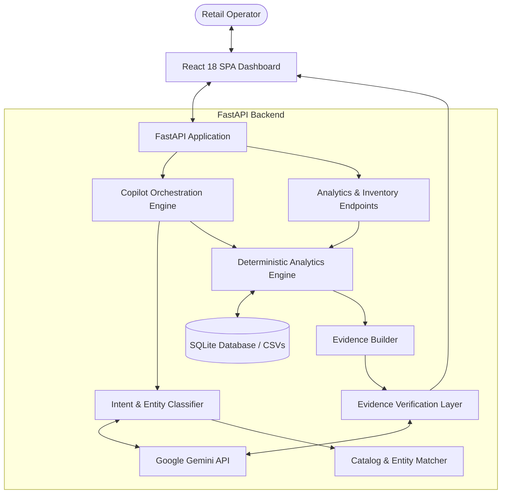

TRACK_ID=PS03

# RetailIQ

## Evidence-First Sales & Inventory Copilot

A reliable, evidence-backed retail intelligence copilot combining deterministic Python analytics with Google Gemini natural-language understanding. RetailIQ empowers retail managers and inventory planners to answer business questions, detect stock-out risks, optimize replenishment, and monitor sales trends—with every recommendation grounded in verified data.

---

## 1. Problem

Retail operators face fragmented sales receipts, complex inventory spreadsheets, and siloed store reports:

* **Stock-Out Uncertainty**: High-velocity products frequently run out of stock before reorder triggers are identified, causing lost revenue.
* **Capital Trapped in Overstock**: Excess inventory sits in warehouses for months, tying up operating capital and risking obsolescence.
* **Manual Data Crunching**: Calculating daily velocity, days of coverage, and store-by-store sales trends across dozens of SKUs requires tedious spreadsheet work.
* **Unreliable Generative AI**: Generic AI dashboards often hallucinate numbers or invent metrics, making them dangerous for business-critical inventory decisions.

---

## 2. Proposed Solution

**RetailIQ** provides an evidence-first sales and inventory copilot that bridges natural-language interaction with deterministic retail computation:

* **Conversational Interface**: Retail managers ask questions in plain English (*"Which products are likely to run out soon?"*, *"Which store generated the most revenue?"*).
* **Deterministic Calculation**: Business metrics—revenue, units sold, average daily sales, inventory coverage, target stock, and reorder quantities—are computed exclusively in Python.
* **Evidence-Backed Explanations**: Google Gemini synthesizes explanations strictly from verified analytical evidence tables.
* **Operational Decision Support**: Prioritized attention feeds flag critical stockouts, overstock capital, sales surges, and sales drops automatically.

---

## 3. Why RetailIQ?

RetailIQ addresses the fundamental flaw of applying LLMs to quantitative business operations:

```text
Standard AI Analytics (High Hallucination Risk):
Question ──► LLM Hallucinates Calculation ──► Unreliable Answer

RetailIQ Evidence-First Architecture (Safe & Auditable):
Question
   │
   ▼
Intent & Entity Resolution (Gemini NLU + Database Validation)
   │
   ▼
Deterministic Analytics Engine (Python + SQLite Calculations)
   │
   ▼
Verified Evidence Layer (Exact Numbers, Coverage Days, Reorder Qty)
   │
   ▼
Gemini Explanation Layer (Synthesizes Language Strictly from Evidence)
   │
   ▼
Actionable, Grounded Answer + Interactive Evidence Panel
```

> **Core Principle**: *Gemini understands and explains. Python calculates. Evidence proves.*

---

## 4. Key Capabilities

### Sales Intelligence
* **Sales Summaries**: Total revenue, units sold, transaction counts, and average daily revenue over arbitrary or predefined date windows.
* **Product Performance**: SKU-level revenue, unit volume, selling days, and average daily velocity.
* **Store Comparison**: Regional revenue and volume rankings across physical store locations.
* **Category Breakdown**: Category share, revenue contribution, and volume mix.
* **Daily Sales Trends**: Time-series revenue tracking with baseline anomaly detection.

### Inventory Intelligence
* **Stock-Out Risk Detection**: Real-time identification of items below critical inventory coverage thresholds.
* **Coverage Estimation**: Days of coverage calculated from recent 30-day demand velocity.
* **Deterministic Reorder Sizing**: Target stock and replenishment unit recommendations based on lead-time coverage.
* **Overstock Detection**: Identification of excess inventory (>45 days coverage) and capital locked in idle stock.
* **Velocity Classification**: Product segmentation into Fast, Medium, and Slow moving tiers.
* **Prioritized Attention Feed**: Unified alerts ranking stockouts, overstocks, demand surges, and sales drops by urgency.

### AI Copilot
* **Natural-Language Understanding**: Zero-shot question routing powered by Gemini structured JSON classification.
* **Entity Resolution**: Resilient catalog matching against products and stores.
* **Ambiguity Handling**: Proactive clarification when queries match multiple items.
* **Offline Fallback**: Rule-based classifier and deterministic templating guarantee operation even if external AI is unavailable.

---

## 5. How It Works

1. **User Question**: A retail operator enters a natural-language inquiry.
2. **Intent & Entity Extraction**: The query is parsed into a `StructuredIntent` containing the analytics type, matched product ID, store ID, and date boundaries.
3. **Deterministic Execution**: The intent routes to Python analytics functions that query the SQLite database using parameterized queries.
4. **Evidence Construction**: Computed values are structured into an audit table containing current stock, average daily sales, coverage days, and formulas.
5. **Grounded Explanation**: Gemini generates a clear narrative explanation derived strictly from the evidence metrics.
6. **Delivery**: The user receives a structured answer alongside interactive evidence tables, assumptions, and recommended actions.

---

## 6. System Architecture



---

## 7. Evidence-First Architecture

In RetailIQ, **evidence** is not an afterthought—it is the structural foundation of every response:

* **Answer**: Natural-language explanation grounded in data.
* **Evidence**: The raw, verifiable numbers produced by Python (e.g. `current_stock=12`, `ADS=4.37`, `days_of_coverage=2.75`).
* **Assumptions**: Transparent calculation rules (e.g. *"Demand window: 30 days"*, *"Target coverage: 21 days"*).
* **Recommendations**: Quantified operational actions (e.g. *"Reorder 80 units for Indiranagar"*).
* **Data Status**: Explicit flags (`complete`, `incomplete`, `no_data`, `ambiguous`, `unavailable`).

> RetailIQ reduces hallucination risk by separating numerical computation from language generation and grounding explanations in verified evidence.

---

## 8. AI + Deterministic Intelligence

The application enforces a strict operational boundary between language processing and business computation:

| Responsibility | Technology | Implementation |
| :--- | :--- | :--- |
| **Natural-Language Understanding** | Google Gemini API | Translates user questions into structured analytical parameters |
| **Intent Extraction** | Gemini / Python Fallback | Generates structured JSON schema with confidence scoring |
| **Entity Resolution** | Python + SQLite | Matches product names, aliases, store cities, and ISO dates |
| **Revenue & Sales Metrics** | Python | Calculates `revenue = quantity * unit_price` deterministically |
| **Sales Aggregation** | Python + SQLite | Parameterized SQL aggregation across dates, stores, and categories |
| **Growth & Comparison** | Python | Computes period-over-period percentage changes |
| **Average Daily Sales (ADS)** | Python | Computes rolling 30-day demand velocity |
| **Inventory Coverage** | Python | Computes `Current Stock / ADS` |
| **Stock-Out Risk Level** | Python | Evaluates coverage thresholds (`CRITICAL`, `HIGH`, `MEDIUM`) |
| **Reorder Sizing** | Python | Computes `max(0, Target Stock - Current Stock)` |
| **Evidence Formulation** | Python | Assembles structured data payloads for verification |
| **Final Narrative Explanation** | Google Gemini API | Explains verified metrics in human terms based on evidence |

**Key Rule**: The LLM does not become the source of truth for numerical business decisions.

---

## 9. Inventory Intelligence

All inventory calculations follow transparent, industry-standard retail mathematics:

```text
Average Daily Sales (ADS) = Units Sold in Demand Window / Number of Days (30)

Inventory Coverage = Current Stock / Average Daily Sales

Target Stock = round(Average Daily Sales × Target Coverage Days)

Reorder Quantity = max(0, Target Stock - Current Stock)
```

### Risk Classification Thresholds
* **CRITICAL**: Days of Coverage $\le 3.0$ days (Immediate stockout risk).
* **HIGH**: Days of Coverage $\le 7.0$ days (Replenishment required this week).
* **MEDIUM**: Days of Coverage $\le 14.0$ days (Monitor during normal cycle).
* **LOW / HEALTHY**: Days of Coverage $> 14.0$ days (Adequate safety stock).
* **OVERSTOCK**: Days of Coverage $> 45.0$ days (Excess inventory tying up capital).

---

## 10. Handling Ambiguity & Missing Data

RetailIQ avoids arbitrary guessing:

* **Ambiguous Products**: When a query matches multiple items (e.g., *"How are the headphones doing?"* matches both *Noise-Cancelling Wireless Earbuds* and *Bluetooth Soundbar*), the system returns `needs_clarification=true` with `data_status="ambiguous"` and prompts the user to select the specific product.
* **Unknown Entities**: Non-existent products (*"How is XYZ Ultra Phone performing?"*) or stores (*"Store 999"*) return `data_status="no_data"` explaining the item was not found.
* **Out-of-Dataset Dates**: Queries for dates outside data boundaries (*"Show sales from January 2030"*) return explicit `no_data` responses without fabricating metrics.
* **Fault-Tolerant AI Handling**: If the Gemini API is unreachable, times out, or receives no API key, the system gracefully falls back to deterministic rule-based classifications and structured template answers.

---

## 11. Technology Stack

* **Backend Framework**: Python 3.11, FastAPI, Uvicorn
* **Database & Processing**: SQLite (Local embedded database), Pandas, NumPy
* **Generative AI**: Google Gemini API (`gemini-1.5-flash` via HTTP / official SDK)
* **Frontend**: React 18, TypeScript, Vite, Lucide React icons, Vanilla CSS Design System
* **Validation & Testing**: Pydantic v2, Pytest, HTTPX

---

## 12. Dataset

RetailIQ includes an internally consistent, synthetic retail dataset:

* **Products (`data/products.csv`)**: 40 products across 6 categories (Electronics, Accessories, Home, Personal Care, Office, Grocery) with realistic INR prices (₹179 to ₹3,499).
* **Stores (`data/stores.csv`)**: 4 metropolitan retail locations (Bengaluru, Mumbai, Delhi, Hyderabad).
* **Sales (`data/sales.csv`)**: 11,119 transaction records spanning 120 days (2026-05-08 to 2026-09-04). Total recorded revenue: ₹34,099,044.00.
* **Inventory (`data/inventory.csv`)**: 160 store-product records with calibrated stock levels and reorder thresholds.
* **Integrity**: 100% verified consistency (`revenue == quantity * unit_price`, 0 mismatches across 11,119 records).

---

## 13. Project Structure

```text
RetailIQ/
├── app.py                      # FastAPI server & static SPA mount
├── requirements.txt            # Python dependencies
├── README.md                   # Hackathon submission documentation
├── .gitignore                  # Git exclusions (.env, caches, node_modules)
│
├── src/                        # Core application package
│   ├── config.py               # Constants, thresholds, environment configuration
│   ├── database.py             # SQLite connection management & CSV loader
│   ├── models.py               # Pydantic schemas and API contracts
│   ├── analytics.py            # Deterministic sales analytics engine
│   ├── inventory.py            # Deterministic inventory intelligence engine
│   ├── gemini_client.py        # Safe Google Gemini client wrapper
│   ├── intent.py               # Intent classification & entity matching
│   ├── evidence.py             # Structured evidence builder
│   ├── copilot.py              # Retail copilot orchestration pipeline
│   └── api.py                  # Modular FastAPI router endpoints
│
├── data/                       # Synthetic retail datasets & SQLite database
│   ├── products.csv            # 40 retail products
│   ├── stores.csv              # 4 store locations
│   ├── sales.csv               # 11,119 sales transactions
│   ├── inventory.csv           # 160 inventory records
│   └── retailiq.db             # Local SQLite database
│
├── frontend/                   # React 18 + TypeScript SPA
│   ├── src/                    # UI source code, pages, and components
│   └── dist/                   # Production build served by FastAPI
│
├── tests/                      # Pytest automated test suite (99 tests)
│   ├── test_analytics.py       # Sales analytics calculations
│   ├── test_inventory.py       # Inventory coverage and reorder math
│   ├── test_copilot.py         # End-to-end copilot orchestration & fallbacks
│   ├── test_gemini.py          # Gemini client error handling & parsing
│   ├── test_data.py            # Dataset integrity & schema validations
│   ├── test_database.py        # SQLite queries & loader tests
│   ├── test_health.py          # Health & root endpoints
│   └── test_frontend_serving.py# Production SPA file serving tests
│
└── scripts/                    # Utilities & verification scripts
    └── validate_hackathon_demo.py # Automated end-to-end evaluation script
```

---

## 14. API Overview

### Sales Analytics
* `GET /api/analytics/summary`: Aggregate revenue, units, transactions, and daily averages.
* `GET /api/analytics/trend`: Chronological daily revenue time-series data.
* `GET /api/analytics/top-products`: Ranked products by revenue or unit sales.
* `GET /api/analytics/categories`: Category revenue contributions and percentages.
* `GET /api/analytics/products/{product_id}`: Single product sales performance.
* `GET /api/analytics/stores/{store_id}`: Store-level performance metrics.

### Inventory Intelligence
* `GET /api/inventory/health`: Portfolio health overview, risk distribution, and stock value.
* `GET /api/inventory/risks`: Stock-out risks sorted by coverage urgency.
* `GET /api/inventory/overstock`: Items exceeding 45 days coverage with locked capital.
* `GET /api/inventory/attention`: Prioritized operational feed.
* `GET /api/inventory/velocity`: Segmentation into Fast, Medium, and Slow tiers.
* `GET /api/inventory/{product_id}`: Store-by-store inventory and reorder recommendations.

### AI Copilot & Core
* `POST /api/copilot`: Natural-language question answering with verified evidence.
* `POST /api/copilot/intent`: Intent classification and entity resolution.
* `GET /health`: Service health check (`{"status": "healthy", "app": "RetailIQ", "track_id": "PS03"}`).

---

## 15. Example Copilot Questions

Evaluators can test the following validated questions:

1. **Inventory Risk**:
   > *"Which products are likely to run out soon?"*
   > Identifies 18 product/store combinations at stockout risk with coverage under 7 days.

2. **Store Comparison**:
   > *"Which store generated the most revenue?"*
   > Evaluates all 4 stores; identifies RetailIQ Prime - Indiranagar (₹9.78M) as #1.

3. **Overstock Detection**:
   > *"Which products are overstocked?"*
   > Surfaces 36 records with $>45$ days of coverage and quantifies excess capital.

4. **Sales Trend**:
   > *"Show me the sales trend."*
   > Returns 120 daily sales points totaling ₹34.10M revenue.

5. **Reorder Recommendations**:
   > *"What should I reorder?"*
   > Calculates target stock and exact replenishment units for items at risk.

6. **Category Performance**:
   > *"How are Electronics performing?"*
   > Summarizes ₹16.16M revenue (47.38% share of total retail sales).

---

## 16. Reliability & Security

* **API Key Protection**: `GEMINI_API_KEY` is loaded strictly server-side from environment variables; zero API keys are stored in frontend code, git commits, or documentation.
* **SQL Injection Safety**: 100% of SQLite database queries use parameterized placeholders (`?`). No arbitrary SQL execution endpoints exist.
* **Input Validation**: Handled via Pydantic v2 schemas; empty, null, or malformed queries return clean HTTP 400/422 responses with zero traceback leakage.
* **Fault-Tolerant Copilot**: If Gemini is offline, the system seamlessly uses rule-based classification and deterministic templating.
* **Test Isolation**: All 99 automated tests use mocked Gemini responses and local SQLite data, requiring zero live network calls during automated testing.

---

## 17. Getting Started

### Prerequisites
* Python 3.11+
* Optional: Google Gemini API Key (for live AI explanations; deterministic analytics work without it)

### Quick Start

```bash
# 1. Clone repository
git clone https://github.com/MAHA-VIDHYA-SRI-L/RetailIQ.git
cd RetailIQ

# 2. Install dependencies
pip install -r requirements.txt

# 3. (Optional) Set Gemini API Key
export GEMINI_API_KEY="your_api_key_here"   # Linux/macOS
set GEMINI_API_KEY="your_api_key_here"      # Windows CMD
$env:GEMINI_API_KEY="your_api_key_here"     # Windows PowerShell

# 4. Start RetailIQ
python app.py
```

Open your browser at:
```text
http://localhost:8000
```

---

## 18. Demo Flow

A recommended 2-minute evaluation walk-through:

1. **Dashboard Overview**: Open `http://localhost:8000` to review total revenue (₹34.10M), inventory risk count, overstock capital, and the 120-day interactive sales trend chart.
2. **Review Attention Feed**: Inspect top-priority operational alerts showing critical stockouts and overstock items.
3. **Open Copilot**: Click the **Ask Copilot** button or drawer.
4. **Test Stockout Query**: Ask *"Which products are likely to run out soon?"*. Observe the AI answer, expand the **Evidence** table, and view the reorder recommendations.
5. **Test Store Comparison**: Ask *"Which store generated the most revenue?"*. Confirm the ranking is grounded in exact SQLite aggregations.
6. **Test Ambiguity**: Ask *"How are the headphones doing?"*. Observe that the system asks for clarification rather than guessing.
7. **Test Date Boundary**: Ask *"Show sales from January 2030."*. Observe that the system reports `no_data` rather than hallucinating numbers.

---

## 19. Hackathon Track

```text
Hackathon Track: PS03 — Retail: Sales and Inventory Copilot
```

RetailIQ addresses the PS03 track by uniting generative AI with deterministic retail analytics to deliver an auditable, evidence-grounded copilot for retail operations.

---

## 20. Future Scope

* **POS Webhook Ingestion**: Direct integration with retail point-of-sale systems for live sub-second event streaming.
* **Multi-Echelon Supply Chain**: Supplier lead-time variance tracking and multi-warehouse transfer optimization.
* **Automated Purchase Orders**: Direct EDI/ERP connector integration to draft POs based on verified reorder quantities.
* **Machine Learning Demand Forecasting**: Seasonal ARIMA/Prophet models incorporated into deterministic Python baselines.
* **Role-Based Access Control (RBAC)**: Store-manager vs regional-executive permission tiers.

---

## 21. Team / Project Information

* **Project**: RetailIQ — Evidence-First Sales & Inventory Copilot
* **Track ID**: PS03
* **Repository**: [https://github.com/MAHA-VIDHYA-SRI-L/RetailIQ](https://github.com/MAHA-VIDHYA-SRI-L/RetailIQ)
* **License**: MIT
